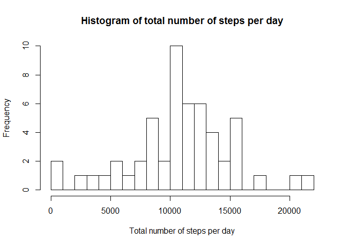
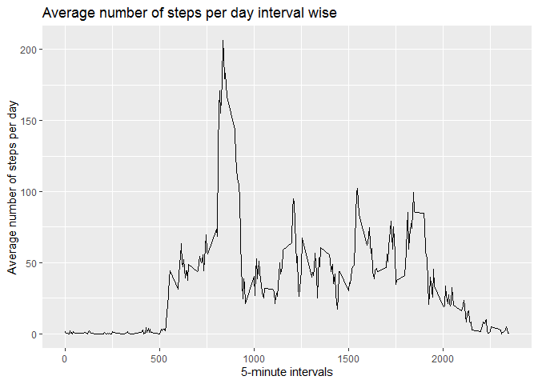
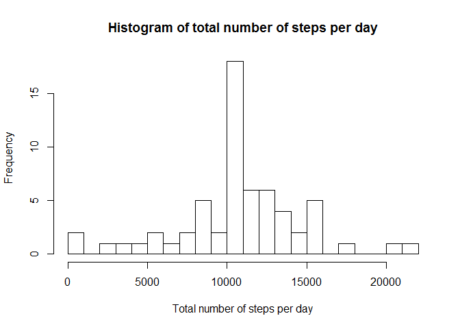
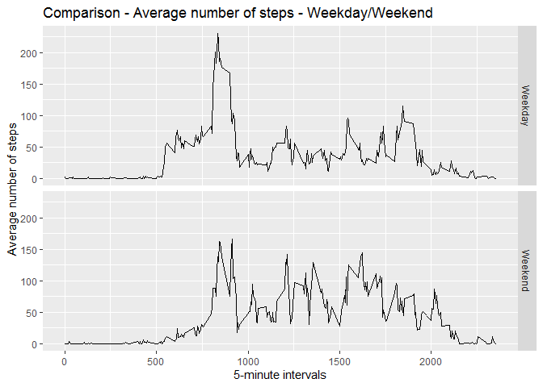

Reproducible Research: Peer Assessment 1
================
Deepjyoti Chakraborty
05/02/2020

\#\#Loading libraries

``` r
library(dplyr)
library(magrittr)
library(ggplot2)
```

\#\#Download and unzip file

``` r
download.file('https://d396qusza40orc.cloudfront.net/repdata%2Fdata%2Factivity.zip', destfile = paste0(getwd(),'/repdata%2Fdata%2Factivity.zip'))
unzip(paste0(getwd(),'/repdata%2Fdata%2Factivity.zip'))
```

\#\#Loading data

``` r
activitydata <- read.csv("activity.csv")
```

\#\#Make table with total steps grouped by day

``` r
stepsperday <- activitydata %>% group_by(date) %>% summarize(totalsteps=sum(steps)) %>% na.omit()
```

\#\#Making histogram of total number of steps per day

``` r
hist(stepsperday$totalsteps, breaks = 30, xlab = "Total number of steps per day", main="Histogram of total number of steps per day")
```

<!-- -->

\#\#Calculate Mean

``` r
mean(stepsperday$totalsteps)
```

    ## [1] 10766.19

\#\#Calculate Median

``` r
median(stepsperday$totalsteps)
```

    ## [1] 10765

\#\#Making data by interval

``` r
databyinterval <- activitydata %>% group_by(interval) %>% summarize(meansteps=mean(steps, na.rm=TRUE))
```

\#\#Plotting time series plot of intervals and average number of steps
per day

``` r
ggplot(databyinterval, aes(interval,meansteps))+geom_line() + xlab("5-minute intervals") + ylab("Average number of steps per day") +ggtitle("Average number of steps per day interval wise")
```

<!-- -->

\#\#Finding which interval contains maximum number of steps

``` r
databyinterval[which.max(databyinterval$meansteps),]
```

    ## # A tibble: 1 x 2
    ##   interval meansteps
    ##      <int>     <dbl>
    ## 1      835      206.

\#\#Calculating no of missing values in the dataset

``` r
sapply(X = activitydata, FUN = function(x) sum(is.na(x)))
```

    ##    steps     date interval 
    ##     2304        0        0

\#\#Creating function to replace with mean

``` r
replace_with_mean <- function(x) replace(x, is.na(x),mean(x,na.rm=TRUE))
```

\#\#Mutating the table to replace NA values with mean of steps for
respective 5-minute intervals

``` r
activitydata_mutated <- activitydata %>% group_by(interval) %>% mutate(steps = replace_with_mean(steps))
```

\#\#Creating new table for total steps grouped by day and histogram

``` r
stepsperday_mutated <- activitydata_mutated %>% group_by(date) %>% summarize(totalsteps=sum(steps)) %>% na.omit()
hist(stepsperday_mutated$totalsteps, breaks = 30, xlab = "Total number of steps per day", main="Histogram of total number of steps per day")
```

<!-- -->

\#\#Calculating mean and median

``` r
mean(stepsperday_mutated$totalsteps)
```

    ## [1] 10766.19

``` r
median(stepsperday_mutated$totalsteps)
```

    ## [1] 10766.19

\#\#Difference between and old and new mean/median

``` r
mean(stepsperday_mutated$totalsteps) - mean(stepsperday$totalsteps)
```

    ## [1] 0

``` r
median(stepsperday_mutated$totalsteps) - median(stepsperday$totalsteps)
```

    ## [1] 1.188679

\#\#Adding columns to the mutated data set for day of the week and type
of day - Weekday/Weekend

``` r
activitydata_mutated$day <- weekdays(as.Date(activitydata_mutated$date))
activitydata_mutated$daytype <- if_else(activitydata_mutated$day %in% c("Monday", "Tuesday", "Wednesday", "Thursday", "Friday"), "Weekday", "Weekend")
```

\#\#Creating new dataset grouped by interval and daytype
(Weekend/Weekday)

``` r
stepsperday_mean_daytype <- activitydata_mutated %>% group_by(interval, daytype) %>% summarize(meansteps=mean(steps))
```

\#\#Making a panel plot containing time-series plot of 5-minute
intervals and average number of steps with respect to type of day

``` r
ggplot(stepsperday_mean_daytype, aes(interval,meansteps))+geom_line() + facet_grid(daytype ~.) + xlab("5-minute intervals") + ylab("Average number of steps") +ggtitle("Comparison - Average number of steps - Weekday/Weekend")
```

<!-- -->
